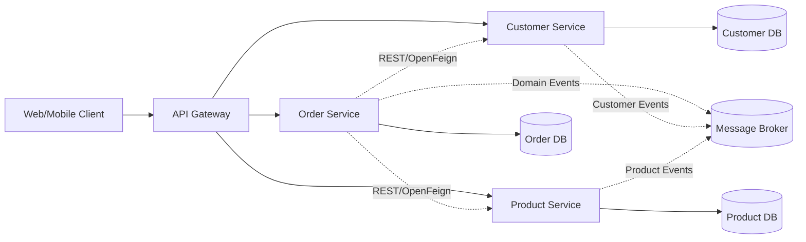
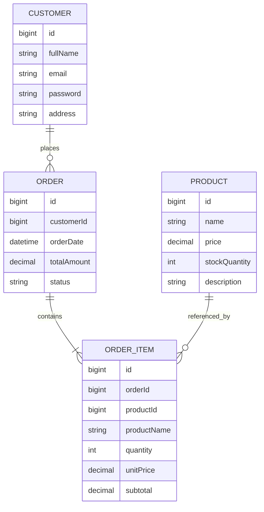
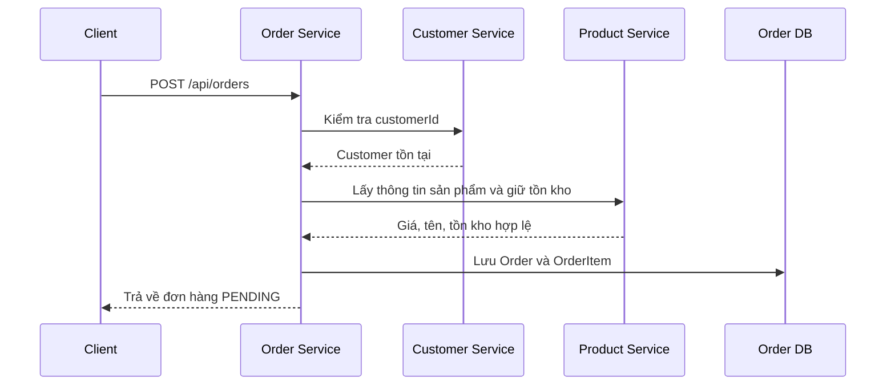
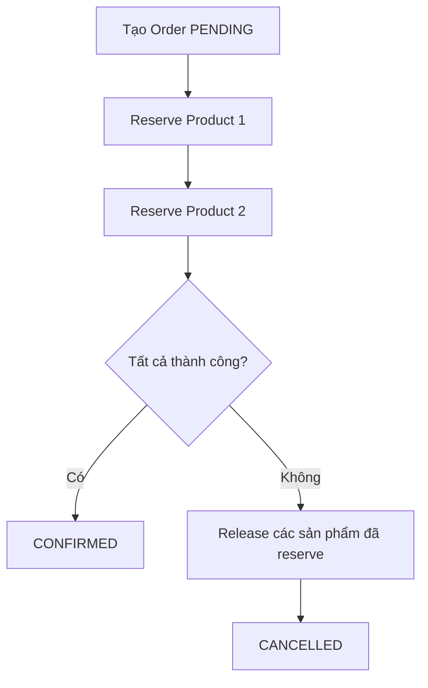

# Thiết kế hệ thống thương mại điện tử

## 1. Kiến trúc tổng thể

Hệ thống thương mại điện tử được phân tách thành 3 project Spring Boot độc lập:

- **Customer Service**: Quản lý khách hàng.
- **Product Service**: Quản lý sản phẩm và tồn kho.
- **Order Service**: Quản lý đơn hàng.

Mỗi service sở hữu một database riêng. Các service không truy cập trực tiếp vào database hoặc source code của nhau.



| Service | Trách nhiệm | Database |
|---|---|---|
| Customer Service | Quản lý tài khoản, thông tin khách hàng và đăng nhập | `customer_db` |
| Product Service | Quản lý sản phẩm, giá và tồn kho | `product_db` |
| Order Service | Tạo và quản lý đơn hàng | `order_db` |

Các thành phần có thể triển khai thêm:

- **API Gateway**: Định tuyến request đến các service.
- **Message Broker**: RabbitMQ hoặc Kafka để phát sự kiện bất đồng bộ.
- **Service Discovery**: Eureka nếu triển khai nhiều instance.
- **Config Server**: Quản lý cấu hình tập trung nếu cần.

## 2. Customer Service

### 2.1. Entity `Customer`

```java
@Entity
@Table(name = "customers")
public class Customer {

    @Id
    @GeneratedValue(strategy = GenerationType.IDENTITY)
    private Long id;

    @Column(nullable = false)
    private String fullName;

    @Column(nullable = false, unique = true)
    private String email;

    @Column(nullable = false)
    private String password;

    private String address;
}
```

Không lưu mật khẩu dạng plain text. Mật khẩu phải được mã hóa bằng BCrypt:

```java
passwordEncoder.encode(rawPassword);
```

### 2.2. Bảng database

```sql
CREATE TABLE customers (
    id BIGINT PRIMARY KEY AUTO_INCREMENT,
    full_name VARCHAR(150) NOT NULL,
    email VARCHAR(150) NOT NULL UNIQUE,
    password VARCHAR(255) NOT NULL,
    address VARCHAR(255),
    created_at TIMESTAMP NOT NULL,
    updated_at TIMESTAMP NOT NULL
);
```

### 2.3. API

| Method | Endpoint | Chức năng |
|---|---|---|
| `POST` | `/api/customers` | Đăng ký khách hàng |
| `GET` | `/api/customers/{id}` | Lấy thông tin khách hàng |
| `PUT` | `/api/customers/{id}` | Cập nhật thông tin |
| `DELETE` | `/api/customers/{id}` | Xóa khách hàng |
| `POST` | `/api/auth/login` | Đăng nhập |
| `GET` | `/api/customers/{id}/exists` | Kiểm tra khách hàng tồn tại |

Response không được trả về trường `password`:

```json
{
  "id": 1,
  "fullName": "Nguyen Van A",
  "email": "a@example.com",
  "address": "Ha Noi"
}
```

### 2.4. Event

Khi tạo hoặc xóa khách hàng, Customer Service có thể phát sự kiện:

```json
{
  "eventType": "CustomerCreated",
  "customerId": 1,
  "occurredAt": "2026-10-08T10:00:00Z"
}
```

## 3. Product Service

### 3.1. Entity `Product`

```java
@Entity
@Table(name = "products")
public class Product {

    @Id
    @GeneratedValue(strategy = GenerationType.IDENTITY)
    private Long id;

    @Column(nullable = false)
    private String name;

    @Column(nullable = false, precision = 19, scale = 2)
    private BigDecimal price;

    @Column(nullable = false)
    private Integer stockQuantity;

    @Column(columnDefinition = "TEXT")
    private String description;
}
```

Nên sử dụng `BigDecimal` cho giá tiền thay vì `double`.

### 3.2. Bảng database

```sql
CREATE TABLE products (
    id BIGINT PRIMARY KEY AUTO_INCREMENT,
    name VARCHAR(200) NOT NULL,
    price DECIMAL(19,2) NOT NULL,
    stock_quantity INT NOT NULL,
    description TEXT,
    created_at TIMESTAMP NOT NULL,
    updated_at TIMESTAMP NOT NULL
);
```

### 3.3. API

| Method | Endpoint | Chức năng |
|---|---|---|
| `POST` | `/api/products` | Tạo sản phẩm |
| `GET` | `/api/products/{id}` | Lấy sản phẩm |
| `GET` | `/api/products` | Tìm kiếm sản phẩm |
| `PUT` | `/api/products/{id}` | Cập nhật sản phẩm |
| `DELETE` | `/api/products/{id}` | Xóa sản phẩm |
| `POST` | `/api/products/{id}/reserve` | Giữ tồn kho |
| `POST` | `/api/products/{id}/release` | Hoàn tồn kho |

Request giữ tồn kho:

```json
{
  "quantity": 2
}
```

Response:

```json
{
  "productId": 10,
  "reservedQuantity": 2,
  "remainingStock": 8
}
```

Các thao tác cập nhật tồn kho phải có transaction để tránh nhiều đơn hàng cùng mua vượt quá số lượng thực tế.

## 4. Order Service

### 4.1. Entity `Order`

```java
@Entity
@Table(name = "orders")
public class Order {

    @Id
    @GeneratedValue(strategy = GenerationType.IDENTITY)
    private Long id;

    @Column(nullable = false)
    private Long customerId;

    @Column(nullable = false)
    private LocalDateTime orderDate;

    @Column(nullable = false, precision = 19, scale = 2)
    private BigDecimal totalAmount;

    @Enumerated(EnumType.STRING)
    @Column(nullable = false)
    private OrderStatus status;
}
```

```java
public enum OrderStatus {
    PENDING,
    CONFIRMED,
    PAID,
    SHIPPING,
    COMPLETED,
    CANCELLED
}
```

### 4.2. Entity `OrderItem`

Chỉ lưu `customerId` là chưa đủ để biểu diễn một đơn hàng. Đơn hàng cần biết khách đã mua sản phẩm nào, số lượng bao nhiêu và giá tại thời điểm mua.

```java
@Entity
@Table(name = "order_items")
public class OrderItem {

    @Id
    @GeneratedValue(strategy = GenerationType.IDENTITY)
    private Long id;

    @Column(nullable = false)
    private Long orderId;

    @Column(nullable = false)
    private Long productId;

    @Column(nullable = false)
    private String productName;

    @Column(nullable = false)
    private Integer quantity;

    @Column(nullable = false, precision = 19, scale = 2)
    private BigDecimal unitPrice;

    @Column(nullable = false, precision = 19, scale = 2)
    private BigDecimal subtotal;
}
```

`OrderItem` nên lưu `productName` và `unitPrice` tại thời điểm đặt hàng. Không nên mỗi lần xem lịch sử đơn hàng lại phụ thuộc hoàn toàn vào Product Service, vì sản phẩm có thể đã đổi tên hoặc đổi giá.

### 4.3. Database

```sql
CREATE TABLE orders (
    id BIGINT PRIMARY KEY AUTO_INCREMENT,
    customer_id BIGINT NOT NULL,
    order_date TIMESTAMP NOT NULL,
    total_amount DECIMAL(19,2) NOT NULL,
    status VARCHAR(30) NOT NULL,
    created_at TIMESTAMP NOT NULL,
    updated_at TIMESTAMP NOT NULL
);

CREATE TABLE order_items (
    id BIGINT PRIMARY KEY AUTO_INCREMENT,
    order_id BIGINT NOT NULL,
    product_id BIGINT NOT NULL,
    product_name VARCHAR(200) NOT NULL,
    quantity INT NOT NULL,
    unit_price DECIMAL(19,2) NOT NULL,
    subtotal DECIMAL(19,2) NOT NULL,

    CONSTRAINT fk_order_items_order
        FOREIGN KEY (order_id) REFERENCES orders(id)
);
```

`customer_id` và `product_id` chỉ là **logical reference**, không tạo foreign key sang database của service khác.

### 4.4. API

| Method | Endpoint | Chức năng |
|---|---|---|
| `POST` | `/api/orders` | Tạo đơn hàng |
| `GET` | `/api/orders/{id}` | Xem chi tiết đơn hàng |
| `GET` | `/api/orders?customerId={id}` | Xem đơn hàng của khách |
| `PATCH` | `/api/orders/{id}/status` | Cập nhật trạng thái |
| `POST` | `/api/orders/{id}/cancel` | Hủy đơn hàng |

Request tạo đơn:

```json
{
  "customerId": 1,
  "items": [
    {
      "productId": 10,
      "quantity": 2
    },
    {
      "productId": 11,
      "quantity": 1
    }
  ]
}
```

Response:

```json
{
  "id": 1001,
  "customerId": 1,
  "orderDate": "2026-10-08T10:20:00",
  "totalAmount": 850000.00,
  "status": "PENDING",
  "items": [
    {
      "productId": 10,
      "productName": "Keyboard",
      "quantity": 2,
      "unitPrice": 300000.00,
      "subtotal": 600000.00
    },
    {
      "productId": 11,
      "productName": "Mouse",
      "quantity": 1,
      "unitPrice": 250000.00,
      "subtotal": 250000.00
    }
  ]
}
```

## 5. Vì sao Order chỉ lưu `customerId`?

Order Service chỉ lưu:

```text
customerId
```

thay vì lưu toàn bộ đối tượng `Customer`.

### 5.1. Tránh phụ thuộc database

Nếu Order Service lưu trực tiếp object `Customer`, hệ thống sẽ cần dùng chung database, tạo foreign key giữa hai service hoặc cho phép Order Service truy cập bảng `customers`. Điều này vi phạm nguyên tắc mỗi microservice sở hữu dữ liệu riêng.

### 5.2. Giảm coupling giữa các service

Customer Service có thể thay đổi cấu trúc:

```text
fullName -> firstName + lastName
```

mà không cần thay đổi bảng `orders`. Order Service chỉ cần biết định danh khách hàng:

```text
customerId = 1
```

### 5.3. Quan hệ nghiệp vụ

```text
Một Customer có nhiều Order
Một Order thuộc về một Customer
```

Đây là quan hệ logic giữa các service, không phải quan hệ foreign key giữa hai database.



### 5.4. Kiểm tra Customer qua API

Khi tạo đơn, Order Service có thể gọi:

```http
GET /api/customers/{customerId}/exists
```

Nếu khách hàng không tồn tại, trả về lỗi:

```json
{
  "code": "CUSTOMER_NOT_FOUND",
  "message": "Customer does not exist"
}
```

Việc gọi API để kiểm tra tồn tại là một API interaction, không phải dùng chung code hoặc database.

### 5.5. Snapshot thông tin giao hàng

Nếu cần lưu thông tin giao hàng tại thời điểm đặt hàng, nên lưu snapshot riêng trong Order Service:

```java
private String shippingName;
private String shippingAddress;
private String shippingPhone;
```

Không nên mỗi lần giao hàng lại phụ thuộc vào địa chỉ hiện tại của Customer, vì khách hàng có thể thay đổi địa chỉ sau khi đặt hàng.

## 6. Luồng tạo đơn hàng



Nếu một sản phẩm không đủ tồn kho:

1. Product Service từ chối thao tác reserve.
2. Order Service không tạo đơn.
3. API trả lỗi `INSUFFICIENT_STOCK`.

Nếu cần xử lý nhiều sản phẩm, có thể dùng Saga:



## 7. Cấu trúc mỗi Spring Boot project

Mỗi project nên độc lập hoàn toàn:

```text
customer-service/
├── src/main/java/com/example/customer
│   ├── controller
│   ├── service
│   ├── repository
│   ├── entity
│   ├── dto
│   ├── mapper
│   ├── exception
│   └── config
└── application.yml

product-service/
├── src/main/java/com/example/product
│   ├── controller
│   ├── service
│   ├── repository
│   ├── entity
│   ├── dto
│   └── exception
└── application.yml

order-service/
├── src/main/java/com/example/order
│   ├── controller
│   ├── service
│   ├── repository
│   ├── entity
│   ├── dto
│   ├── client
│   ├── event
│   └── exception
└── application.yml
```

Mỗi service có:

- `pom.xml` hoặc `build.gradle` riêng.
- Port riêng.
- Database riêng.
- Migration riêng bằng Flyway hoặc Liquibase.
- Repository riêng.
- Dockerfile riêng nếu cần triển khai container.

Ví dụ port:

```text
Customer Service: 8081
Product Service: 8082
Order Service:   8083
API Gateway:     8080
```

## 8. Nguyên tắc quan trọng

1. Không dùng chung database giữa các service.
2. Không import entity của service khác.
3. Không dùng chung Java module chứa các entity nghiệp vụ.
4. Chỉ giao tiếp qua REST API hoặc message broker.
5. `Order` lưu `customerId`, không lưu object `Customer`.
6. `OrderItem` lưu snapshot tên và giá sản phẩm tại thời điểm mua.
7. Không tạo foreign key xuyên database.
8. Mật khẩu phải được mã hóa bằng BCrypt.
9. Giá tiền sử dụng `BigDecimal`.
10. Các thao tác cập nhật tồn kho phải có transaction.
11. API cần có DTO, không trả trực tiếp entity database.
12. Các lỗi giữa service cần được chuẩn hóa bằng mã lỗi rõ ràng.

Thiết kế này đảm bảo ba module độc lập, dễ triển khai riêng, dễ mở rộng và không vi phạm nguyên tắc sở hữu dữ liệu trong kiến trúc microservice.
